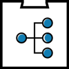

# Event Handler

The Event Handler can be used to publish and receive events that can be used by other applications.

## Table of contents

<!--
Regenerate table of contents with:

npm install --global markdown-toc
markdown-toc -i --maxdepth 3 README.md
-->

<!-- toc -->

- [Links](#links)
- [Publish event](#publish-event)
  * [Publish code example](#publish-code-example)
- [Subscribe to an event](#subscribe-to-an-event)
  * [Receive event code example](#receive-event-code-example)

<!-- tocstop -->

## Links

* [General info](https://acpaas.digipolis.be/nl/product/event-handler-engine)
* [User manual](https://wiki.antwerpen.be/ACPAAS/index.php/Event-Handler_User_Manuals) *(internal access needed)*
* [Swagger documentation](https://acpaas.digipolis.be/nl/product/event-handler-engine/v2.0.0/api-event-handler-v-2/about)

## Publish event

**API documentation:** [Swagger](https://acpaas.digipolis.be/nl/product/event-handler-engine/v2.0.0/api-event-handler-v-2/about#/Publish)

### Publish code example


**Node.js:**

```javascript
const request = require('request-promise-native');

const config = {
    host: 'https://api-gw-o.antwerpen.be', // Dev endpoint
    baseUrl: '/acpaas/eventhandler/v2',
    ownerKey: '[OWNERKEY]',
    namespace: '[NAMESPACE]',
    client_id: '[xxxxx-xxxxx-xxxxx-xxxxx-xxxxx]', // You can find this in your application on the api-store https://api-store-o.antwerpen.be/
    client_secret: '[xxxxx-xxxxx-xxxxx-xxxxx-xxxxx]' // You can find this in your application on the api-store https://api-store-o.antwerpen.be/
}

async function getToken() {
  const { data } = await axios.post(`${config.host}${config.baseUrl}/oauth2/token`, {
    client_id: config.client_id,
    client_secret: config.client_secret,
    grant_type: 'client_credentials',
  });

  return `Bearer ${data.access_token}`;
}

async function sendEvent(topic, message) {
    try {
        const options = {
            body: message,
            headers: {
                'owner-key': config.ownerKey,
                authorization: await getToken(),
            },
            json: true,
            resolveWithFullResponse: true,
            url: `${config.host}${config.baseUrl}/namespaces/${config.namespace}/topics/${topic}/publish`,
        };
        const response = await request.post(options);
        if (response.statusCode !== 204) {
            console.log(`Success`);
        }

    } catch (error) {
        console.log(`Post error ${error.message} from event handler`);
    }

}
sendEvent('[TOPIC]', '{ datakey: "datavalue"}');
```
## Subscribe to an event

Create a subscription in the Event Handler that points to your application: [User manual](https://wiki.antwerpen.be/ACPAAS/index.php/Event-Handler_User_Manuals) *(internal access needed)*.

The Event Handler will post data to an endpoint. Return a success status code when handling the event succeeded or a failure status code otherwise.

Consider securing this endpoint using authentication or a secret HTTP header, which can be set on the Event Handler subscription.

### Receive event code example


**Node.js:**

```javascript
// Express route with bodyparser expected

router.post('/message', handleMessage);

function handleMessage(req, res, next) {
  try {
    console.log(`received message ${body}`)
    // Do something
    // Send success
    return res.json();
  } catch (err) {
    console.log(`HandleMessage Error: ${err}`);
    return next(err);
  }
}
```
